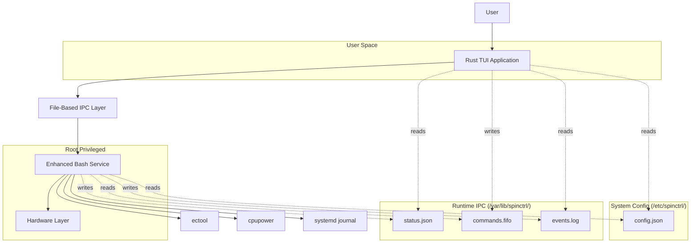

# SpinCtrl - System Design Document

## Overview

SpinCtrl implements a hybrid architecture combining an enhanced bash background service with a modern Rust TUI frontend. The design preserves the reliability and simplicity of the existing bash implementation while adding advanced user interface capabilities through clean file-based IPC.

The system follows a strict privilege separation model where the bash service runs as root and handles all hardware operations, while the Rust TUI runs as a normal user and provides an intuitive interface for monitoring and configuration.

> **Note:** Inline code sketches below are illustrative of the design intent and may differ from the canonical implementation. The source files are authoritative and were updated by the system-wide-config refactor: configuration lives at `/etc/spinctrl/config.json` (root:spinctrl, `0640`), runtime IPC in `/var/lib/spinctrl/` (`0750` dir, `0640` files, `0620` FIFO), the service runs as `Group=spinctrl`, and the TUI pushes config changes via the `apply_config` FIFO command (it does not write the config file).

## Architecture

### High-Level Architecture



### Component Architecture

#### Enhanced Bash Service
- **Base**: Existing `control-acer-spin13-ec.sh` with minimal modifications
- **Enhancements**:
  - Configuration file watcher using `inotifywait`
  - JSON configuration parsing using `jq`
  - Status reporting via JSON files
  - Command processing from FIFO
  - Structured event logging
  - Graceful cleanup of IPC resources

#### Rust TUI Application
- **Framework**: ratatui + crossterm for cross-platform terminal UI
- **Components**:
  - Real-time status monitor
  - Interactive configuration editor
  - Command interface
  - Event log viewer
  - Help system
- **Capabilities**:
  - File watching for live updates
  - Input validation and sanitization
  - Offline operation with cached data

#### IPC Layer
- **Configuration**: `/etc/spinctrl/config.json` (root:spinctrl, 0640; read-only factory defaults — service reads at boot only, never writes it under `ProtectSystem=strict`)
- **Runtime config**: `/var/lib/spinctrl/config_status.json` (root:spinctrl, 0640; persistent runtime config — service writes on `apply_config` push + seeds from `/etc` on first boot; overrides `/etc` on boot; **TUI reads this, never `/etc`**)
- **Status**: `/var/lib/spinctrl/status.json` (service writes, TUI reads)
- **Commands**: `/var/lib/spinctrl/commands.fifo` (TUI writes, service reads)
- **Events**: `/var/lib/spinctrl/events.log` (service appends, TUI reads)

## Components and Interfaces

### Bash Service Interface

#### Configuration Loading
```bash
load_config() {
    local config_file="/etc/spinctrl/config.json"
    if [[ -f "$config_file" ]]; then
        BATTERY_THRESHOLD=$(jq -r '.battery.threshold // 80' "$config_file")
        WARN_TEMP=$(jq -r '.thermal.warn_temp // 70' "$config_file")
        HIGH_TEMP=$(jq -r '.thermal.high_temp // 55' "$config_file")
        SHUTDOWN_TEMP=$(jq -r '.thermal.shutdown_temp // 80' "$config_file")
        FAN_OFF_TEMP=$(jq -r '.thermal.fan_off_temp // 50' "$config_file")
        FAN_MAX_TEMP=$(jq -r '.thermal.fan_max_temp // 75' "$config_file")
        CPU_GOVERNOR_AC=$(jq -r '.cpu.governor_ac // "performance"' "$config_file")
        CPU_GOVERNOR_BATTERY=$(jq -r '.cpu.governor_battery // "powersave"' "$config_file")
    fi
}
```

#### Status Reporting
```bash
write_status() {
    local status_file="/var/lib/spinctrl/status.json"
    local temp_file="${status_file}.tmp"
    
    jq -n \
        --arg battery_capacity "$(get_battery_capacity)" \
        --arg ac_connected "$(get_ac_status)" \
        --arg cpu_governor "$(get_cpu_governor)" \
        --arg charge_control "$(get_charge_control_status)" \
        --arg timestamp "$(date -Iseconds)" \
        '{
            battery: {
                capacity: ($battery_capacity | tonumber),
                charging: ($charge_control == "normal")
            },
            power: {
                ac_connected: ($ac_connected == "1"),
                cpu_governor: $cpu_governor
            },
            timestamp: $timestamp,
            service_pid: '$$'
        }' > "$temp_file"
    
    mv "$temp_file" "$status_file"
}
```

#### Command Processing
```bash
process_commands() {
    local commands_fifo="/var/lib/spinctrl/commands.fifo"
    
    while IFS= read -r command; do
        case "$command" in
            "battery_threshold:"*)
                local threshold="${command#battery_threshold:}"
                if [[ "$threshold" =~ ^[0-9]+$ ]] && [ "$threshold" -ge 50 ] && [ "$threshold" -le 100 ]; then
                    BATTERY_THRESHOLD="$threshold"
                    log "Updated battery threshold to $threshold%"
                    write_event "config_changed" "battery_threshold" "$threshold"
                fi
                ;;
            "force_charge")
                set_charge_control "normal"
                log "Force charging enabled"
                write_event "command_executed" "force_charge" ""
                ;;
            "cpu_governor:"*)
                local governor="${command#cpu_governor:}"
                if set_cpu_governor "$governor"; then
                    log "CPU governor set to $governor"
                    write_event "command_executed" "cpu_governor" "$governor"
                fi
                ;;
        esac
    done < "$commands_fifo"
}
```

### Rust TUI Interface

#### Application Structure
```rust
pub struct App {
    status: SystemStatus,
    config: Config,
    mode: AppMode,
    selected_tab: Tab,
    input_state: InputState,
    event_log: Vec<LogEntry>,
    file_watcher: FileWatcher,
}

pub enum AppMode {
    Monitoring,
    Editing,
    Help,
}

pub enum Tab {
    Status,
    Battery,
    CPU,
    Thermal,
    Events,
}
```

#### Status Monitoring
```rust
impl App {
    pub async fn load_status(&mut self) -> Result<(), Error> {
        let status_content = tokio::fs::read_to_string("/var/lib/spinctrl/status.json").await?;
        self.status = serde_json::from_str(&status_content)?;
        Ok(())
    }
    
    pub async fn start_file_watcher(&mut self) -> Result<(), Error> {
        let (tx, rx) = tokio::sync::mpsc::channel(100);
        
        let mut watcher = notify::recommended_watcher(move |res| {
            if let Ok(event) = res {
                let _ = tx.try_send(event);
            }
        })?;
        
        watcher.watch(Path::new("/var/lib/spinctrl"), RecursiveMode::NonRecursive)?;
        
        self.file_watcher = FileWatcher { watcher, receiver: rx };
        Ok(())
    }
}
```

#### Configuration Management
```rust
impl Config {
    pub fn save(&self) -> Result<(), Error> {
        let config_path = "/var/lib/spinctrl/config_status.json";
        let temp_path = format!("{}.tmp", config_path);
        
        let json = serde_json::to_string_pretty(self)?;
        std::fs::write(&temp_path, json)?;
        std::fs::rename(temp_path, config_path)?;
        
        Ok(())
    }
    
    pub fn validate(&self) -> Result<(), Vec<String>> {
        let mut errors = Vec::new();
        
        if self.battery.threshold < 50 || self.battery.threshold > 100 {
            errors.push("Battery threshold must be between 50-100%".to_string());
        }
        
        if self.thermal.warn_temp <= self.thermal.high_temp {
            errors.push("Warning temperature must be higher than high temperature".to_string());
        }
        
        if errors.is_empty() { Ok(()) } else { Err(errors) }
    }
}
```

## Data Models

### Configuration Schema
```json
{
  "$schema": "http://json-schema.org/draft-07/schema#",
  "title": "SpinCtrl Configuration",
  "type": "object",
  "properties": {
    "battery": {
      "type": "object",
      "properties": {
        "threshold": {
          "type": "integer",
          "minimum": 50,
          "maximum": 100,
          "default": 80
        },
        "force_charge": {
          "type": "boolean",
          "default": false
        }
      },
      "required": ["threshold"]
    },
    "cpu": {
      "type": "object",
      "properties": {
        "governor_ac": {
          "type": "string",
          "enum": ["performance", "powersave", "ondemand", "conservative"],
          "default": "performance"
        },
        "governor_battery": {
          "type": "string",
          "enum": ["performance", "powersave", "ondemand", "conservative"],
          "default": "powersave"
        }
      }
    },
    "thermal": {
      "type": "object",
      "properties": {
        "warn_temp": {"type": "integer", "minimum": 40, "maximum": 100, "default": 70},
        "high_temp": {"type": "integer", "minimum": 30, "maximum": 90, "default": 55},
        "shutdown_temp": {"type": "integer", "minimum": 50, "maximum": 110, "default": 80},
        "fan_off_temp": {"type": "integer", "minimum": 20, "maximum": 80, "default": 50},
        "fan_max_temp": {"type": "integer", "minimum": 40, "maximum": 100, "default": 75}
      }
    }
  }
}
```

### Status Data Model
```rust
#[derive(Debug, Serialize, Deserialize)]
pub struct SystemStatus {
    pub battery: BatteryStatus,
    pub power: PowerStatus,
    pub thermal: ThermalStatus,
    pub timestamp: DateTime<Utc>,
    pub service_pid: u32,
}

#[derive(Debug, Serialize, Deserialize)]
pub struct BatteryStatus {
    pub capacity: u8,
    pub charging: bool,
    pub threshold_active: bool,
}

#[derive(Debug, Serialize, Deserialize)]
pub struct PowerStatus {
    pub ac_connected: bool,
    pub cpu_governor: String,
}

#[derive(Debug, Serialize, Deserialize)]
pub struct ThermalStatus {
    pub zones: Vec<ThermalZone>,
}
```

### Command Protocol
```rust
#[derive(Debug, Serialize, Deserialize)]
pub enum Command {
    SetBatteryThreshold(u8),
    ForceCharge,
    StopCharge,
    SetCpuGovernor(String),
    SetThermalProfile(String),
    /// Full config push from TUI; applied at runtime, not persisted to /etc.
    ApplyConfig(String),
    ReloadConfig,
}

impl Command {
    pub fn to_fifo_string(&self) -> String {
        match self {
            Command::SetBatteryThreshold(threshold) => format!("battery_threshold:{}", threshold),
            Command::ForceCharge => "force_charge".to_string(),
            Command::StopCharge => "stop_charge".to_string(),
            Command::SetCpuGovernor(governor) => format!("cpu_governor:{}", governor),
            Command::SetThermalProfile(profile) => format!("thermal_profile:{}", profile),
            Command::ApplyConfig(json) => format!("apply_config:{}", json),
            Command::ReloadConfig => "reload_config".to_string(),
        }
    }
}
```

## Error Handling

### Bash Service Error Handling
```bash
# Retry mechanism with exponential backoff
retry_command() {
    local command="$1"
    local max_attempts=3
    local attempt=1
    local delay=1
    
    while [ $attempt -le $max_attempts ]; do
        if eval "$command"; then
            return 0
        fi
        
        log "ERROR: Command failed (attempt $attempt/$max_attempts): $command"
        
        if [ $attempt -lt $max_attempts ]; then
            sleep $delay
            delay=$((delay * 2))
        fi
        
        attempt=$((attempt + 1))
    done
    
    log "ERROR: Command failed after $max_attempts attempts: $command"
    return 1
}

# Graceful cleanup
cleanup() {
    log "Service shutting down, restoring defaults"
    
    # Restore normal charging
    retry_command "ectool chargecontrol normal"
    
    # Clean up IPC files
    rm -f /var/lib/spinctrl/status.json
    rm -f /var/lib/spinctrl/commands.fifo
    
    # Kill background processes
    if [[ -n "$MONITOR_PID" ]] && kill -0 "$MONITOR_PID" 2>/dev/null; then
        kill "$MONITOR_PID"
        wait "$MONITOR_PID" 2>/dev/null
    fi
    
    exit 0
}

trap cleanup SIGTERM SIGINT
```

### Rust TUI Error Handling
```rust
#[derive(Debug, thiserror::Error)]
pub enum AppError {
    #[error("IO error: {0}")]
    Io(#[from] std::io::Error),
    
    #[error("JSON parsing error: {0}")]
    Json(#[from] serde_json::Error),
    
    #[error("Service communication error: {0}")]
    ServiceComm(String),
    
    #[error("Configuration validation error: {0:?}")]
    ConfigValidation(Vec<String>),
    
    #[error("Permission denied: {0}")]
    PermissionDenied(String),
}

impl App {
    pub async fn handle_error(&mut self, error: AppError) {
        match error {
            AppError::ServiceComm(_) => {
                self.mode = AppMode::ServiceOffline;
                self.show_message("Service unavailable - operating in read-only mode");
            }
            AppError::PermissionDenied(path) => {
                self.show_message(&format!(
                    "Permission denied accessing {}. Please check group membership.", 
                    path
                ));
            }
            AppError::ConfigValidation(errors) => {
                self.show_validation_errors(errors);
            }
            _ => {
                self.show_message(&format!("Error: {}", error));
            }
        }
    }
}
```

## Testing Strategy

### Bash Service Testing
```bash
# Unit tests for individual functions
test_get_battery_capacity() {
    # Mock battery capacity file
    mkdir -p /tmp/test/sys/class/power_supply/BAT0
    echo "75" > /tmp/test/sys/class/power_supply/BAT0/capacity
    
    BATTERY_PATH="/tmp/test/sys/class/power_supply/BAT0"
    local result=$(get_battery_capacity)
    
    assert_equals "75" "$result"
    
    rm -rf /tmp/test
}

# Integration tests with mock hardware
test_charge_control_integration() {
    # Mock ectool command
    ectool() {
        echo "chargecontrol $1" >> /tmp/ectool_calls
        return 0
    }
    
    # Test threshold behavior
    BATTERY_THRESHOLD=80
    handle_ac_plugged
    
    # Verify ectool was called correctly
    assert_file_contains "/tmp/ectool_calls" "chargecontrol normal"
}
```

### Rust TUI Testing
```rust
#[cfg(test)]
mod tests {
    use super::*;
    use tempfile::TempDir;
    
    #[tokio::test]
    async fn test_config_validation() {
        let mut config = Config::default();
        config.battery.threshold = 120; // Invalid
        
        let result = config.validate();
        assert!(result.is_err());
        assert!(result.unwrap_err().iter().any(|e| e.contains("threshold")));
    }
    
    #[tokio::test]
    async fn test_status_parsing() {
        let json = r#"{
            "battery": {"capacity": 75, "charging": true},
            "power": {"ac_connected": true, "cpu_governor": "performance"},
            "timestamp": "2024-01-01T12:00:00Z",
            "service_pid": 1234
        }"#;
        
        let status: SystemStatus = serde_json::from_str(json).unwrap();
        assert_eq!(status.battery.capacity, 75);
        assert!(status.power.ac_connected);
    }
    
    #[test]
    fn test_file_permissions() {
        let temp_dir = TempDir::new().unwrap();
        let config_path = temp_dir.path().join("config.json");
        
        let config = Config::default();
        config.save_to_path(&config_path).unwrap();
        
        let metadata = std::fs::metadata(&config_path).unwrap();
        let permissions = metadata.permissions();
        
        // Should be readable by owner and group, not world
        assert!(permissions.mode() & 0o044 != 0);
        assert!(permissions.mode() & 0o004 == 0);
    }
}
```

### Mock Hardware Interface
```rust
#[cfg(test)]
pub struct MockHardware {
    pub battery_capacity: u8,
    pub ac_connected: bool,
    pub charge_control_calls: Vec<String>,
    pub cpu_governor_calls: Vec<String>,
}

impl MockHardware {
    pub fn new() -> Self {
        Self {
            battery_capacity: 50,
            ac_connected: false,
            charge_control_calls: Vec::new(),
            cpu_governor_calls: Vec::new(),
        }
    }
    
    pub fn simulate_ac_plug(&mut self) {
        self.ac_connected = true;
    }
    
    pub fn verify_charge_control_called(&self, mode: &str) -> bool {
        self.charge_control_calls.iter().any(|call| call == mode)
    }
}
```

## Deployment and Installation

### Systemd Service Unit
```ini
[Unit]
Description=SpinCtrl Hardware Management Service
After=multi-user.target
Wants=multi-user.target

[Service]
Type=simple
ExecStart=/usr/local/bin/spinctrl-service
Restart=always
RestartSec=5
User=root
Group=spinctrl

# Security settings
NoNewPrivileges=true
ProtectHome=true
ProtectSystem=strict
ReadWritePaths=/var/lib/spinctrl /sys/class/power_supply

[Install]
WantedBy=multi-user.target
```

### Installation Script
```bash
#!/bin/bash
# install.sh

set -e

# Create system user and group
if ! getent group spinctrl >/dev/null; then
    groupadd -r spinctrl
fi

# Install binaries
install -m 755 target/release/spinctrl-tui /usr/local/bin/
install -m 755 scripts/spinctrl-service.sh /usr/local/bin/spinctrl-service

# Install systemd service
install -m 644 systemd/spinctrl.service /etc/systemd/system/
systemctl daemon-reload

# Create IPC directory
mkdir -p /var/lib/spinctrl
chown root:spinctrl /var/lib/spinctrl
chmod 750 /var/lib/spinctrl

# Create default configuration
if [[ ! -f /var/lib/spinctrl/config.json ]]; then
    cat > /var/lib/spinctrl/config.json << 'EOF'
{
  "battery": {
    "threshold": 80
  },
  "cpu": {
    "governor_ac": "performance",
    "governor_battery": "powersave"
  },
  "thermal": {
    "warn_temp": 70,
    "high_temp": 55,
    "shutdown_temp": 80,
    "fan_off_temp": 50,
    "fan_max_temp": 75
  }
}
EOF
    chown root:spinctrl /var/lib/spinctrl/config.json
    chmod 640 /etc/spinctrl/config.json
fi

# Enable and start service
systemctl enable spinctrl
systemctl start spinctrl

echo "SpinCtrl installed successfully!"
echo "Add users to the 'spinctrl' group to use the TUI:"
echo "  sudo usermod -a -G spinctrl \$USER"
```

This design provides a robust, secure, and maintainable system that preserves the reliability of the existing bash implementation while adding modern interface capabilities through the Rust TUI component.